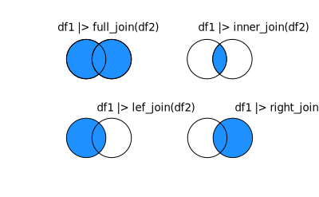

```{r setup, include=FALSE}
knitr::opts_chunk$set(warning = FALSE, message = FALSE) 
```

# Keep or Drop Columns

## Select {#sec-select}

The `select()` function is used to keep or drop columns.

```{r}
#| echo: false
#| warning: false
#| message: false
#| fig-height: 4
#| fig-width: 8
library(grid)
library(ggarrow)
library(colorspace)
library(knitr)

create_df <- function(bottom_right, rows, cols, colors, by_row = T, width = NULL, height = NULL) {
  h <- ifelse(is.null(height), (1 - bottom_right[2] * 2)/rows, height)
  w <- ifelse(is.null(width), .35 / cols, width)
  x <- bottom_right[1]
  y <- bottom_right[2]

  fills <- adjust_transparency(colors, alpha = .5)
  for (row in 1:rows) {
    for (col in 1:cols) {
      grid.draw(rectGrob(x = x, y = y, 
                         width = w, height = h, 
                         gp = gpar(
                           col = ifelse(by_row,
                                        colors[row],
                                        colors[col]),
                         fill = ifelse(by_row,
                                        fills[row],
                                        fills[col]))))
      x <- x + w
    }
    x <- bottom_right[1]
    y <- y + h + .001
  }
}
grid.newpage()
create_df(c(.15, .25), 5, 3, c("dodgerblue3", "springgreen3", "lightsalmon3"), by_row = F, width = 0.1166667, height = .12)

create_df(c(.85, .25), 5, 1, c("dodgerblue3"), by_row = F, width = 0.1166667, height = .12)

grid.draw(ggarrow::grob_arrow(x = unit(c(.55, .7), "npc"),
                              y = unit(c(.5, .5), "npc"),
                              length_head = unit(.025, "npc"),
                              arrow_head = ggarrow::arrow_head_wings(offset = 45, inset = 45),
                              shaft_width = unit(.025, "npc"),
                              gp = gpar(fill = adjust_transparency("grey65", alpha = .5), col = "grey60")))

grid.text("df |> select(Col1)", gp = gpar(fontsize = 15),x = unit(.5, "npc"), y = unit(.92, "npc"))

grid.text("Col1", gp = gpar(fontsize = 15),x = unit(.15, "npc"), y = unit(.74, "npc"))
grid.text("Col2", gp = gpar(fontsize = 15),x = unit(.265, "npc"), y = unit(.74, "npc"))
grid.text("Col3", gp = gpar(fontsize = 15),x = unit(.38, "npc"), y = unit(.74, "npc"))

grid.text("Col1", gp = gpar(fontsize = 15),x = unit(.85, "npc"), y = unit(.74, "npc"))
```

```{r}
library(dplyr)
library(tidyverse)
colnames(starwars %>% select(name, homeworld)) # here, we keep only the name and homeworld columns

colnames(starwars %>% select(-name, -homeworld)) # here, we get rid of the name and homeworld columns
```

There are different selectors you can use to select a group of columns:

-   `:` to select a range of consecutive columns

-   `!` to negate a selection

-   `c()` to combine selections

-   `&` and `|` to select the intersection or union of variables

-   `starts_with()` select columns that start with a pattern

-   `ends_with()` select columns that end with a pattern

-   `contains()` select columns that contain a pattern

-   `matches()` select columns that match a pattern

-   `num_range()` match a numerical range

-   `all_of()` matches variable names in a character vector, and all names must be present, otherwise an out-of-bounds error is thrown

-   `any_of()` does the same as `all_of()`, except that no error is thrown for names that don't exist

-   `where()` applies a function to all variables and selects those for which the function returns `TRUE`

```{r}
colnames(starwars %>% select(height:birth_year)) # select all columns between height and birth_year

colnames(starwars %>% select(c("mass", "sex"))) # select mass and sex

colnames(starwars %>% select(!c("mass", "sex"))) # select all columns BUT mass and sex

colnames(starwars %>% select(where(is.character) | where(is.integer))) # select columns that are character type or integer type
```

```{r}
# now we'll use the iris dataset to demonstrate some other examples
colnames(iris)

colnames(iris %>% select(starts_with("Sepal")))

colnames(iris %>% select(ends_with("Length")))
```

```{r}
library(nycflights13)

colnames(flights)

colnames(flights %>% select(contains("dep")))

colnames(flights %>% select(matches("arr_+")))

cols_to_select <- c("month", "day", "year", "time")

# colnames(flights %>% select(all_of(cols_to_select))) will throw an error because time doesn't exist

colnames(flights %>% select(any_of(cols_to_select)))
```

```{r}
example_df <- data.frame("X1" = 1:10, "X2" = 11:20, "X3" = 21:30)

colnames(example_df %>% select(num_range("X", 1:2)))
```

## Pull

If you want to extract columns as vectors, use the `pull()` function.

```{r}
head(starwars %>% pull(name))
```

# Keep or Drop Observations {#sec-keep-or-drop-observations}

## By Condition {#sec-by-condition}

Use the `filter()` function from **dplyr** to pick rows based on some condition, such as `==` and `!=` for equality and inequality, **stringr** functions, and `>`/`>=`/`<`/`<=` for numeric comparisons.

```{r}
#| echo: false
#| warning: false
#| message: false
#| fig-height: 4
#| fig-width: 8
grid.newpage()

# CREATE ORIGINAL/UNFILTERED DF
create_df(c(.1, .15), 6, 3, c("dodgerblue3", "springgreen3", "dodgerblue3" ,"dodgerblue3", "lightsalmon3", "grey65"), width = 0.1166667, height = .12)

# CREATE FILTERED DF
create_df(c(.65, .3), 4, 3, c("dodgerblue3","dodgerblue3" ,"dodgerblue3", "grey65"), width = 0.1166667, height = .12)

# ADD ARROW
grid.draw(ggarrow::grob_arrow(x = unit(c(.435, .55), "npc"),
                              y = unit(c(.475, .475), "npc"),
                              length_head = unit(.025, "npc"),
                              arrow_head = ggarrow::arrow_head_wings(offset = 45, inset = 45),
                              shaft_width = unit(.025, "npc"),
                              gp = gpar(fill = adjust_transparency("grey65", alpha = .5), col = "grey60")))

# ADD COLUMN LABELS
grid.text("Col1", gp = gpar(fontsize = 15),x = unit(.1, "npc"), y = unit(.835 - .075, "npc"))
grid.text("Col2", gp = gpar(fontsize = 15),x = unit(.2175, "npc"), y = unit(.835 - .075, "npc"))
grid.text("Col3", gp = gpar(fontsize = 15),x = unit(.2175 + .2175 - .1, "npc"), y = unit(.835 - .075, "npc"))
grid.text("Col1", gp = gpar(fontsize = 15),x = unit(.65, "npc"), y = unit(.67, "npc"))
grid.text("Col2", gp = gpar(fontsize = 15),x = unit(.65 + .1175, "npc"), y = unit(.67, "npc"))
grid.text("Col3", gp = gpar(fontsize = 15),x = unit(.65 + .1175 * 2, "npc"), y = unit(.67, "npc"))

grid.text("A", gp = gpar(fontsize = 15),x = unit(.1, "npc"), y = unit(.64, "npc"))
grid.text("B", gp = gpar(fontsize = 15),x = unit(.1, "npc"), y = unit(.64 - 0.1225, "npc"))
grid.text("B", gp = gpar(fontsize = 15),x = unit(.1, "npc"), y = unit(.64 - 0.1225 * 2, "npc"))
grid.text("C", gp = gpar(fontsize = 15),x = unit(.1, "npc"), y = unit(.64 - 0.1225 * 3, "npc"))
grid.text("B", gp = gpar(fontsize = 15),x = unit(.1, "npc"), y = unit(.64 - 0.1225 * 4, "npc"))

grid.text("B", gp = gpar(fontsize = 15),x = unit(.65, "npc"), y = unit(.55, "npc"))
grid.text("B", gp = gpar(fontsize = 15),x = unit(.65, "npc"), y = unit(.55 - 0.1225, "npc"))
grid.text("B", gp = gpar(fontsize = 15),x = unit(.65, "npc"), y = unit(.55 - 0.1225 * 2, "npc"))

grid.text("df |> filter(Col1 == 'B')", gp = gpar(fontsize = 15),x = unit(.5, "npc"), y = unit(.92, "npc"))
```

The primary function you will use to keep or drop observations is `filter()`. Some expressions to keep in mind with filtering are:

-   `!=` checks for inequalities, `==` checks for equivalence, `<` and `<=` for less than and less than or equal (and `>` and `>=` for greater than)

-   `!` for the complement, `&` for intersection, and `|` for union

-   `is.na()` to check if values are NA

-   `%in%` to check if a value is in a vector

```{r}
head(starwars %>% 
       select(name, homeworld) %>%
       filter(homeworld == "Tatooine")) # keep only characters who are from Tatooine

head(starwars %>% 
       filter(!is.na(birth_year))) # keep only characters whose birth years we know

head(starwars %>%
       drop_na()) # you can also use the drop_na function from tidyr to get rid of NAs 

head(starwars %>%
       filter(mass > 100)) # keep only characters who are heavier than 100

head(starwars %>%
       filter(mass < 100 & height < 75)) # keep only characters who weigh less than 100 and are shorter than 75

head(starwars %>%
       filter(homeworld %in% c("Naboo", "Alderaan"))) # keep characters whose homeworld is in the vector

head(starwars %>%
       filter(!homeworld %in% c("Naboo", "Alderaan"))) # keep characters whose homeworld is NOT in the vector
```

## Unique Observations

To keep only observations that are unique (remove duplicates), use `distinct()`.

```{r}
head(starwars %>% distinct(homeworld)) # you can specify specific columns

set.seed(123)
randomly_selected_characters <- starwars %>% slice_sample(n = 20, replace = TRUE)

nrow(randomly_selected_characters)

nrow(randomly_selected_characters %>% distinct()) # removed 3 duplicates
```

## Slicing

To select rows by index, use `slice()`. To select randomly, use `slice_sample()`. Use `slice_min()` and `slice_max()` to select the maximum and minimum `n` values by a particular column. `slice_head()` and `slice_tail()` allow you to select the first or last `n` rows.

```{r}
starwars %>% 
  slice(1:5)

starwars %>% 
  slice_sample(n = 5)

starwars %>% 
  slice_min(height, n = 5)

starwars %>% 
  slice_max(height, n = 5)

starwars %>% 
  slice_head(n = 5)

starwars %>% 
  slice_tail(n = 5)
```

# Ordering {#sec-ordering}

## Rearrange column order

Use `relocate()` to move columns around:

```{r}
head(starwars %>% 
  relocate(birth_year, .before = NULL, .after= name))
```

## Rearrange observations

Use `arrange()` with or without `desc()` to sort a dataframe in ascending or descending order, respectively (either automatically or by a specific column).

```{r}
#| echo: false
#| warning: false
#| message: false
#| fig-height: 4
#| fig-width: 8
grid.newpage()

# CREATE ORIGINAL/UNFILTERED DF
create_df(c(.1, .15), 6, 3, c("dodgerblue3", "springgreen3", "dodgerblue3" ,"dodgerblue3", "lightsalmon3", "grey65"), width = 0.1166667, height = .12)

# CREATE FILTERED DF
create_df(c(.66, .15), 6, 3, c("springgreen3", "dodgerblue3", "dodgerblue3" ,"dodgerblue3", "lightsalmon3", "grey65"), width = 0.1166667, height = .12)

# ADD ARROW
grid.draw(ggarrow::grob_arrow(x = unit(c(.435, .55), "npc"),
                              y = unit(c(.475, .475), "npc"),
                              length_head = unit(.025, "npc"),
                              arrow_head = ggarrow::arrow_head_wings(offset = 45, inset = 45),
                              shaft_width = unit(.025, "npc"),
                              gp = gpar(fill = adjust_transparency("grey65", alpha = .5), col = "grey60")))

# ADD COLUMN LABELS
grid.text("Col1", gp = gpar(fontsize = 15), x = unit(.1, "npc"), y = unit(.835 - .075, "npc"))
grid.text("Col2", gp = gpar(fontsize = 15), x = unit(.2175, "npc"), y = unit(.835 - .075, "npc"))
grid.text("Col3", gp = gpar(fontsize = 15), x = unit(.2175 + .2175 - .1, "npc"), y = unit(.835 - .075, "npc"))

grid.text("A", gp = gpar(fontsize = 15), x = unit(.1, "npc"), y = unit(.64, "npc"))
grid.text("B", gp = gpar(fontsize = 15), x = unit(.1, "npc"), y = unit(.64 - 0.1225, "npc"))
grid.text("B", gp = gpar(fontsize = 15), x = unit(.1, "npc"), y = unit(.64 - 0.1225 * 2, "npc"))
grid.text("C", gp = gpar(fontsize = 15), x = unit(.1, "npc"), y = unit(.64 - 0.1225 * 3, "npc"))
grid.text("B", gp = gpar(fontsize = 15), x = unit(.1, "npc"), y = unit(.64 - 0.1225 * 4, "npc"))

grid.text("df |> arrange(Col1)", gp = gpar(fontsize = 15), x = unit(.5, "npc"), y = unit(.92, "npc"))

grid.text("Col1", gp = gpar(fontsize = 15), x = unit(.66, "npc"), y = unit(.835 - .075, "npc"))
grid.text("Col2", gp = gpar(fontsize = 15), x = unit(.66 + .1175, "npc"), y = unit(.835 - .075, "npc"))
grid.text("Col3", gp = gpar(fontsize = 15), x = unit(.66 + .1175 * 2, "npc"), y = unit(.835 - .075, "npc"))

grid.text("A", gp = gpar(fontsize = 15),x = unit(.66, "npc"), y = unit(.64, "npc"))
grid.text("B", gp = gpar(fontsize = 15),x = unit(.66, "npc"), y = unit(.64 - 0.1225, "npc"))
grid.text("B", gp = gpar(fontsize = 15),x = unit(.66, "npc"), y = unit(.64 - 0.1225 * 2, "npc"))
grid.text("B", gp = gpar(fontsize = 15),x = unit(.66, "npc"), y = unit(.64 - 0.1225 * 3, "npc"))
grid.text("C", gp = gpar(fontsize = 15),x = unit(.66, "npc"), y = unit(.64 - 0.1225 * 4, "npc"))
```

```{r}
head(starwars %>% 
       arrange(birth_year) %>% 
       relocate(birth_year, .after= name))

head(starwars %>% 
       arrange(desc(birth_year)) %>% 
       relocate(birth_year, .after= name))
```

# Grouping and Summarizing {#sec-grouping-and-summarizing}

The `group_by()` function performs functions based on groupings, such as mutations or summarizations. The `summarize()` function allows you to apply summary functions (such as mean, median, etc.) to calculate a new data frame, typically based on groupings.

```{r}
#| echo: false
#| warning: false
#| message: false
#| fig-height: 4
#| fig-width: 8
grid.newpage()

# CREATE ORIGINAL/UNFILTERED DF
create_df(c(.1, .1), 8, 3, c("lightsalmon3", "springgreen3", "dodgerblue3" ,"springgreen3", "lightsalmon3", "dodgerblue3",  "dodgerblue3", "grey65"), width = 0.075, height = .1)

grid.text("Col1", gp = gpar(fontsize = 15), x = unit(.1, "npc"), y = unit(.81, "npc"))
grid.text("Col2", gp = gpar(fontsize = 15), x = unit(.175, "npc"), y = unit(.81, "npc"))
grid.text("Col3", gp = gpar(fontsize = 15), x = unit(.25, "npc"), y = unit(.81, "npc"))

# ADD ARROWS
grid.draw(ggarrow::grob_arrow(x = unit(c(.31, .37), "npc"),
                              y = unit(c(.475, .475), "npc"),
                              length_head = unit(.025, "npc"),
                              arrow_head = ggarrow::arrow_head_wings(offset = 45, inset = 45),
                              shaft_width = unit(.025, "npc"),
                              gp = gpar(fill = adjust_transparency("grey65", alpha = .5), col = "grey60")))

grid.draw(ggarrow::grob_arrow(x = unit(c(.61 + .015, .67  + .015), "npc"),
                              y = unit(c(.475, .475), "npc"),
                              length_head = unit(.025, "npc"),
                              arrow_head = ggarrow::arrow_head_wings(offset = 45, inset = 45),
                              shaft_width = unit(.025, "npc"),
                              gp = gpar(fill = adjust_transparency("grey65", alpha = .5), col = "grey60")))

grid.text("B", gp = gpar(fontsize = 15), x = unit(.1, "npc"), y = unit(.81-.1, "npc"))
grid.text("B", gp = gpar(fontsize = 15), x = unit(.1, "npc"), y = unit(.81-.1 * 2, "npc"))
grid.text("A", gp = gpar(fontsize = 15), x = unit(.1, "npc"), y = unit(.81-.1 * 3, "npc"))
grid.text("C", gp = gpar(fontsize = 15), x = unit(.1, "npc"), y = unit(.81-.1 * 4, "npc"))
grid.text("B", gp = gpar(fontsize = 15), x = unit(.1, "npc"), y = unit(.81-.1 * 5, "npc"))
grid.text("C", gp = gpar(fontsize = 15), x = unit(.1, "npc"), y = unit(.81-.1 * 6 - .01, "npc"))
grid.text("A", gp = gpar(fontsize = 15), x = unit(.1, "npc"), y = unit(.81-.1 * 7 - .01, "npc"))

grid.text("2", gp = gpar(fontsize = 15), x = unit(.175, "npc"), y = unit(.81-.1, "npc"))
grid.text("4", gp = gpar(fontsize = 15), x = unit(.175, "npc"), y = unit(.81-.1 * 2, "npc"))
grid.text("1", gp = gpar(fontsize = 15), x = unit(.175, "npc"), y = unit(.81-.1 * 3, "npc"))
grid.text("8", gp = gpar(fontsize = 15), x = unit(.175, "npc"), y = unit(.81-.1 * 4, "npc"))
grid.text("3", gp = gpar(fontsize = 15), x = unit(.175, "npc"), y = unit(.81-.1 * 5, "npc"))
grid.text("11", gp = gpar(fontsize = 15), x = unit(.175, "npc"), y = unit(.81-.1 * 6 - .01, "npc"))
grid.text("5", gp = gpar(fontsize = 15), x = unit(.175, "npc"), y = unit(.81-.1 * 7 - .01, "npc"))

create_df(c(.425, .075 + .05), 2, 3, c("springgreen3", "springgreen3"), width = 0.075, height = .1)

create_df(c(.425, .3 + .05), 2, 3, c("lightsalmon3", "lightsalmon3"), width = 0.075, height = .1)

create_df(c(.425, .525 + .05), 3, 3, c("dodgerblue3", "dodgerblue3", "dodgerblue3"), width = 0.075, height = .1)

create_df(c(.75, .3), 4, 2, c("springgreen3", "dodgerblue3", "lightsalmon3", "grey65"), width = 0.1166667, height = .12)

grid.text("Col1", gp = gpar(fontsize = 15), x = unit(.75, "npc"), y = unit(.67, "npc"))
grid.text("Col2Sum", gp = gpar(fontsize = 15), x = unit(.8675, "npc"), y = unit(.67, "npc"))

grid.text("A", gp = gpar(fontsize = 15), x = unit(.75, "npc"), y = unit(.67 - .125, "npc"))
grid.text("B", gp = gpar(fontsize = 15), x = unit(.75, "npc"), y = unit(.67 - .125 * 2, "npc"))
grid.text("C", gp = gpar(fontsize = 15), x = unit(.75, "npc"), y = unit(.67 - .125 * 3, "npc"))

grid.text("6", gp = gpar(fontsize = 15), x = unit(.8675, "npc"), y = unit(.67  - .125, "npc"))
grid.text("9", gp = gpar(fontsize = 15), x = unit(.8675, "npc"), y = unit(.67  - .125 * 2, "npc"))
grid.text("19", gp = gpar(fontsize = 15), x = unit(.8675, "npc"), y = unit(.67  - .125 * 3, "npc"))

grid.text("df |> group_by(Col1) |> summarize(Col2Sum = sum(Col2))", gp = gpar(fontsize = 15), x = unit(.5, "npc"), y = unit(.92, "npc"))
```

## Summarize Data {#sec-summarize-data}

```{r}
head(starwars %>% 
  group_by(homeworld) %>%
  summarize(avg_height = mean(height))) # gives you the mean height on each homeworld

head(starwars %>%
       group_by(homeworld, species) %>%
       summarize(avg_height = mean(height))) # you can also group by multiple variables

# also use last(), first(), and nth() to get that observation within each
head(starwars %>% 
       group_by(homeworld) %>% 
       arrange(birth_year) %>% # arrange by birth year
       filter(n() > 2) %>% # only show planets with more than 1 character
       summarize(youngest = first(name))) # show the name of the first observation
```

## Count Data {#sec-count-data}

To count data, you can either use the `summarize()` function or the `count()` function.

```{r}
#| echo: false
#| warning: false
#| message: false
#| fig-height: 4
#| fig-width: 8
grid.newpage()

# CREATE ORIGINAL/UNFILTERED DF
create_df(c(.1, .15), 6, 3, c("dodgerblue3", "springgreen3", "dodgerblue3" ,"dodgerblue3", "lightsalmon3", "grey65"), width = 0.1166667, height = .12)

# ADD COLUMN LABELS
grid.text("Col1", gp = gpar(fontsize = 15), x = unit(.1, "npc"), y = unit(.835 - .075, "npc"))
grid.text("Col2", gp = gpar(fontsize = 15), x = unit(.2175, "npc"), y = unit(.835 - .075, "npc"))
grid.text("Col3", gp = gpar(fontsize = 15), x = unit(.2175 + .2175 - .1, "npc"), y = unit(.835 - .075, "npc"))

grid.text("A", gp = gpar(fontsize = 15),x = unit(.1, "npc"), y = unit(.64, "npc"))
grid.text("B", gp = gpar(fontsize = 15),x = unit(.1, "npc"), y = unit(.64 - 0.1225, "npc"))
grid.text("B", gp = gpar(fontsize = 15),x = unit(.1, "npc"), y = unit(.64 - 0.1225 * 2, "npc"))
grid.text("C", gp = gpar(fontsize = 15),x = unit(.1, "npc"), y = unit(.64 - 0.1225 * 3, "npc"))
grid.text("B", gp = gpar(fontsize = 15),x = unit(.1, "npc"), y = unit(.64 - 0.1225 * 4, "npc"))

# ADD ARROW
grid.draw(ggarrow::grob_arrow(x = unit(c(.45, .65), "npc"),
                              y = unit(c(.475, .475), "npc"),
                              length_head = unit(.025, "npc"),
                              arrow_head = ggarrow::arrow_head_wings(offset = 45, inset = 45),
                              shaft_width = unit(.025, "npc"),
                              gp = gpar(fill = adjust_transparency("grey65", alpha = .5), col = "grey60")))

create_df(c(.75, .3), 4, 2, c("springgreen3", "dodgerblue3", "lightsalmon3", "grey65"), width = 0.1166667, height = .12)

grid.text("Col1", gp = gpar(fontsize = 15), x = unit(.75, "npc"), y = unit(.67, "npc"))
grid.text("n", gp = gpar(fontsize = 15), x = unit(.865, "npc"), y = unit(.67, "npc"))

grid.text("A", gp = gpar(fontsize = 15),x = unit(.75, "npc"), y = unit(.55, "npc"))
grid.text("B", gp = gpar(fontsize = 15),x = unit(.75, "npc"), y = unit(.425, "npc"))
grid.text("C", gp = gpar(fontsize = 15),x = unit(.75, "npc"), y = unit(.55 - .125*2, "npc"))

grid.text("1", gp = gpar(fontsize = 15),x = unit(.75 + .115, "npc"), y = unit(.55, "npc"))
grid.text("3", gp = gpar(fontsize = 15),x = unit(.75 + .115, "npc"), y = unit(.425, "npc"))
grid.text("1", gp = gpar(fontsize = 15),x = unit(.75 + .115, "npc"), y = unit(.55 - .125*2, "npc"))

grid.text("df |> count(Col1)", gp = gpar(fontsize = 15), x = unit(.5, "npc"), y = unit(.92, "npc"))
```

```{r}
head(starwars %>%
       group_by(homeworld) %>%
       summarize(num_characters = n()))

head(starwars %>%
       count(homeworld, sort = TRUE))
```

# Transforming Data

## Mutation {#sec-mutation}

The `mutate()` function allows you to apply a variety of functions to create new variables or change existing ones.

```{r}
#| echo: false
#| warning: false
#| message: false
#| fig-height: 4
#| fig-width: 8
grid.newpage()

# CREATE ORIGINAL/UNFILTERED DF
create_df(c(.1, .15), 6, 3, c("dodgerblue3", "springgreen3", "lightsalmon3"), width = 0.1166667 - .025, height = .12, by_row = F)

# CREATE FILTERED DF
create_df(c(.66, .15), 6, 4, c("dodgerblue3", "springgreen3", "lightsalmon3", "gold1"), width = 0.1166667 - .025, height = .12, by_row = F)

# ADD ARROW
grid.draw(ggarrow::grob_arrow(x = unit(c(.4, .55), "npc"),
                              y = unit(c(.475, .475), "npc"),
                              length_head = unit(.025, "npc"),
                              arrow_head = ggarrow::arrow_head_wings(offset = 45, inset = 45),
                              shaft_width = unit(.025, "npc"),
                              gp = gpar(fill = adjust_transparency("grey65", alpha = .5), col = "grey60")))

# ADD COLUMN LABELS
grid.text("Col1", gp = gpar(fontsize = 15), x = unit(.1, "npc"), y = unit(.835 - .075, "npc"))
grid.text("Col2", gp = gpar(fontsize = 15), x = unit(.2175- .025, "npc"), y = unit(.835 - .075, "npc"))
grid.text("Col3", gp = gpar(fontsize = 15), x = unit(.2175 + .065, "npc"), y = unit(.835 - .075, "npc"))

grid.text("df |> mutate(Col4 = 1:5)", gp = gpar(fontsize = 15), x = unit(.5, "npc"), y = unit(.92, "npc"))

grid.text("Col1", gp = gpar(fontsize = 15), x = unit(.66, "npc"), y = unit(.835 - .075, "npc"))
grid.text("Col2", gp = gpar(fontsize = 15), x = unit(.66 + 0.09, "npc"), y = unit(.835 - .075, "npc"))
grid.text("Col3", gp = gpar(fontsize = 15), x = unit(.66 + 0.09*2, "npc"), y = unit(.835 - .075, "npc"))
grid.text("Col4", gp = gpar(fontsize = 15), x = unit(.66 + 0.09*3 + .005, "npc"), y = unit(.835 - .075, "npc"))

grid.text("1", gp = gpar(fontsize = 15), x = unit(.66 + 0.09*3 + .005, "npc"), y = unit(.64, "npc"))
grid.text("2", gp = gpar(fontsize = 15), x = unit(.66 + 0.09*3 + .005, "npc"), y = unit(.64 - .12, "npc"))
grid.text("3", gp = gpar(fontsize = 15), x = unit(.66 + 0.09*3 + .005, "npc"), y = unit(.64 - .12 * 2, "npc"))
grid.text("4", gp = gpar(fontsize = 15), x = unit(.66 + 0.09*3 + .005, "npc"), y = unit(.64 - .12 * 3, "npc"))
grid.text("5", gp = gpar(fontsize = 15), x = unit(.66 + 0.09*3 + .005, "npc"), y = unit(.64 - .12 * 4 - .0075, "npc"))
```

### Basic operations

You can perform basic operations between columns

```{r}
# for example, calculate character BMI (mass/height in m^2)
head(starwars %>% 
       mutate(bmi = mass/(height/100)^2) %>%
       select(name, bmi))

# or, create variables based on if-else statements
head(starwars %>%
       mutate(height_category = ifelse(height > 183, "Tall", "Short")) %>%
       select(name, height, height_category))
```

### Offset

Lag or lead elements based on the previous/next values. This is helpful for calculations such as percent change

```{r}
usairmiles <- data.frame("year" = 1937:1960, "miles" = as.vector(airmiles))

head(usairmiles %>% mutate(last_month = dplyr::lag(miles),
                      next_month = dplyr::lead(miles)))
```

### Cumulative Calculations

Cumulative functions can be useful for calculating sums and other statistics over time.

```{r}
head(usairmiles %>% mutate(cumsum(miles))) # sums over time

head(usairmiles %>% mutate(cummean(miles))) # calculates avg over time

head(usairmiles %>% mutate(cummax(miles))) # saves the max so far

head(usairmiles %>% mutate(cummin(miles))) 

head(usairmiles %>% mutate(cumprod(miles)))
```

`cumall()` and `cumany()` return boolean vectors that are TRUE/FALSE until the first instance where a condition is `TRUE`.

```{r}
# cumall() creates a vector that is TRUE until it finds the first false:
head(usairmiles %>% mutate(cumall(miles < 1000)))

# cumany() creates a vector that is FALSE until it finds the first TRUE:
head(usairmiles %>% mutate(cumany(miles > 1000)))
```

### Vectorized if-else

Oftentimes, you will have situations where your data has multiple conditions. Using the `ifelse()` function would require you to have multiple nested if-else statements. Instead, you can use the `case_when()` function to mutate your data.

```{r}
head(starwars %>%
       mutate(height_category = case_when(between(height, 170, 183) ~ "Average",
                                          height >= 183 ~ "Tall",
                                          height <= 170 ~ "Average", 
                                          .default = NA)) %>%
       select(name, height, height_category), 5)
```

See this [cheat sheet](https://github.com/rstudio/cheatsheets/blob/main/data-transformation.pdf) for other helpful functions for mutations.

## Long and Wide Data {#sec-long-and-wide-data}

Wide data has a column per "group", whereas long data has a "group" column. For example, a time series would have a column per year as a wide dataset, and a column called year as a long dataset.

```{r}
#| echo: false
#| warning: false
#| message: false
#| fig-height: 4
#| fig-width: 8
library(grid)
library(ggarrow)
library(colorspace)
library(knitr)
grid.newpage()

create_df <- function(bottom_right, rows, cols, colors, by_row = T, width = NULL, height = NULL) {
  h <- ifelse(is.null(height), (1 - bottom_right[2] * 2)/rows, height)
  w <- ifelse(is.null(width), .35 / cols, width)
  x <- bottom_right[1]
  y <- bottom_right[2]

  fills <- adjust_transparency(colors, alpha = .5)
  for (row in 1:rows) {
    for (col in 1:cols) {
      grid.draw(rectGrob(x = x, y = y, 
                         width = w, height = h, 
                         gp = gpar(
                           col = ifelse(by_row,
                                        colors[row],
                                        colors[col]),
                         fill = ifelse(by_row,
                                        fills[row],
                                        fills[col]))))
      x <- x + w
    }
    x <- bottom_right[1]
    y <- y + h + .001
  }
}
# CREATE ORIGINAL/UNFILTERED DF
create_df(c(.2, .15), 10, 2, c("dodgerblue3", "dodgerblue3" ,"dodgerblue3", "lightsalmon3", "lightsalmon3", "lightsalmon3", "springgreen3", "springgreen3", "springgreen3","grey65"), width = 0.1, height = .075)

# CREATE FILTERED DF
create_df(c(.65, .3), 4, 3, c("springgreen3", "lightsalmon3", "dodgerblue3"), width = 0.1166667, height = .12, by_row = F)

# ADD ARROW
grid.draw(ggarrow::grob_arrow(x = unit(c(.4, .55), "npc"),
                              y = unit(c(.6, .6), "npc"),
                              length_head = unit(.025, "npc"),
                              arrow_head = ggarrow::arrow_head_wings(offset = 45, inset = 45),
                              shaft_width = unit(.025, "npc"),
                              gp = gpar(fill = adjust_transparency("grey65", alpha = .5), col = "grey60")))

grid.draw(ggarrow::grob_arrow(x = unit(c(.55, .4), "npc"),
                              y = unit(c(.4, .40), "npc"),
                              length_head = unit(.025, "npc"),
                              arrow_head = ggarrow::arrow_head_wings(offset = 45, inset = 45),
                              shaft_width = unit(.025, "npc"),
                              gp = gpar(fill = adjust_transparency("grey65", alpha = .5), col = "grey60")))

# ADD LABELS
grid.text("name", gp = gpar(fontsize = 15), x = unit(.2, "npc"), y = unit(.835, "npc"))
grid.text("value", gp = gpar(fontsize = 15), x = unit(.3, "npc"), y = unit(.835, "npc"))

curr_var <- 1

set.seed(123)
vals <- sample(1:10, 9, replace = T)

for (i in 1:9) {
  if (i == 4) {
    curr_var <- 2
  }
  if (i == 7) {
    curr_var <- 3
  }
grid.text(paste0("var", curr_var), gp = gpar(fontsize = 15), x = unit(.2, "npc"), y = unit(.835 - .07575 * i, "npc"))
grid.text(vals[i], gp = gpar(fontsize = 15), x = unit(.3, "npc"), y = unit(.835 - .07575 * i, "npc"))
}

grid.text("var1", gp = gpar(fontsize = 15),x = unit(.65, "npc"), y = unit(.67, "npc"))
grid.text("var2", gp = gpar(fontsize = 15),x = unit(.65 + .1175, "npc"), y = unit(.67, "npc"))
grid.text("var3", gp = gpar(fontsize = 15),x = unit(.65 + .1175 * 2, "npc"), y = unit(.67, "npc"))

idx <- 1
for (var in 0:2) {
  for (row in 1:3) {
    grid.text(vals[idx], gp = gpar(fontsize = 15),x = unit(.65 + .1175 * var, "npc"), y = unit(.67 - .125 * row, "npc"))
    idx <- idx + 1
  }
}

grid.text("pivot_wider()", gp = gpar(fontsize = 15),x = unit(.475, "npc"), y = unit(.7, "npc"))

grid.text("pivot_longer()", gp = gpar(fontsize = 15),x = unit(.475, "npc"), y = unit(.3, "npc"))
```

To convert a dataset from wide to long, use `pivot_longer()`:

```{r}
# this is wide
head(as.data.frame(USPersonalExpenditure))

# make it long
exp_long <- as.data.frame(USPersonalExpenditure) %>% tibble::rownames_to_column("type") %>%
  # use all but the type column to combine into 1
  pivot_longer(-type,  
               # the columns we combine now are in a "year" column
               names_to = "year", 
               # the values from those columns go into this column
               values_to = "expenditure")
head(exp_long)
```

To make a dataset wide, use `pivot_wider()`:

```{r}
Seatbelts2 <- data.frame(Year=floor(time(Seatbelts)),
Month=factor(cycle(Seatbelts),
labels=month.abb), Seatbelts) %>% select(Month, Year, DriversKilled)
head(Seatbelts2)

Seatbelts_wide <- Seatbelts2 %>% pivot_wider(names_from = Month, values_from = DriversKilled)
head(Seatbelts_wide)
```

# Joining Data {#sec-joining-data}

## Merging On Common Columns

To join datasets that share columns in common, we use different types of joins to merge the datasets based on specified columns.

{fig-align="center" width="100%"}

```{r}
ratings <- c(6.6, 7.6, 8.6, 8.7, 8.3, 7.7, 6.8, 6.3)
movies <- c("Attack of the Clones", "Revenge of the Sith",
            "A New Hope", "The Empire Strikes Back", "Return of the Jedi",
            "The Force Awakens", "The Last Jedi", "The Rise of Skywalker")

starwars_movies <- data.frame(movies, ratings)

# to expand the "films" column in starwars, we will use unnest() from tidyr

# this now has a row for each character's appearance in each movie
starwars2 <- starwars %>% 
  unnest(films)

# to create a simple example, I am only taking the first row per movie (so 7 rows)
starwars3 <- starwars2 %>% 
  select(name, films) %>%
  group_by(films) %>%
  summarize(name = first(name)) 

starwars3

starwars_movies
```

### Left and Right Joins

A left join keeps all of the observations from the left-hand (first) dataset, and a right join keeps all of the observations from the right-hand (or second) dataset.

```{r}
unique(starwars2$films) # this dataset does not have 2 of the movies
unique(starwars_movies$movies) # this data set has all but The Phantom Menace

# when we left join, we will keep all rows from starwars3
# any films that are in starwars3 but not in starwars_movies will have NA values
starwars3 %>% left_join(starwars_movies, by = c("films" = "movies"))

# if we right join instead, you'll see that it keeps all movies in starwars_movies
# and leaves all character names from movies that starwars3 hdoesn't have NA
starwars3 %>% right_join(starwars_movies, by = c("films" = "movies"))
```

### Inner Join

Sometimes it's ok to leave NAs in certain columns as you want to keep as much data from the "dominant" (left or right) dataset that you're joining on, but other times you don't want missing data. Use an inner join in this case, which will only keep rows that both datasets have.

```{r}
starwars3 %>% inner_join(starwars_movies, by = c("films" = "movies"))
```

### Full Join

An outer or full join keeps all rows from both datasets and often results in many NAs.

```{r}
starwars3 %>% full_join(starwars_movies, by = c("films" = "movies"))
```

### Join on multiple columns

```{r}
weather_at_dest <- flights %>% 
  inner_join(weather, 
             by = c("time_hour", "origin"))

# you can also use join_by(time_hour, origin), join_by("columnA" == "columna", "columnB" == "columnb")
```

## Adding New Rows

To add new rows to a dataset, you can use the `bind_rows()` function to join two datasets with the same columns.

```{r}
df1 <- data.frame("id" = c("A", "B", "C"),
                  "val" = c(1, 2, 3))

df2 <- data.frame("id" = c("D", "E", "F"),
                  "val" = c(4, 5, 6))

df1 %>% bind_rows(df2)
```

This is particularly helpful when you have a list of dataframes:

```{r}
df3 <- data.frame("id" = c("G", "H", "I"),
                  "val" = c(7, 8, 9))

df_list <- list(df1, df2, df3)

bind_rows(df_list)
```
